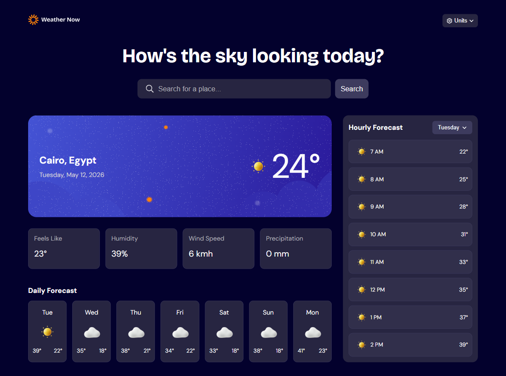
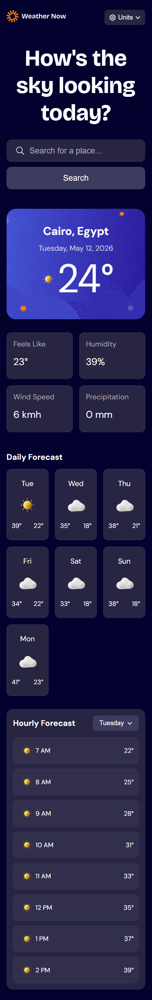

# Frontend Mentor - Weather app solution

This is a solution to the [Weather app challenge on Frontend Mentor](https://www.frontendmentor.io/challenges/weather-app-K1FhddVm49). Frontend Mentor challenges help you improve your coding skills by building realistic projects. 

## Table of contents

- [Overview](#overview)
  - [The challenge](#the-challenge)
  - [Screenshot](#screenshot)
  - [Links](#links)
- [My process](#my-process)
  - [Built with](#built-with)
  - [AI Collaboration](#ai-collaboration)
- [Author](#author)
- [Acknowledgments](#acknowledgments)

## Overview

### The challenge

Users should be able to:

- Search for weather information by entering a location in the search bar
- View current weather conditions including temperature, weather icon, and location details
- See additional weather metrics like "feels like" temperature, humidity percentage, wind speed, and precipitation amounts
- Browse a 7-day weather forecast with daily high/low temperatures and weather icons
- View an hourly forecast showing temperature changes throughout the day
- Switch between different days of the week using the day selector in the hourly forecast section
- Toggle between Imperial and Metric measurement units via the units dropdown 
- Switch between specific temperature units (Celsius and Fahrenheit) and measurement units for wind speed (km/h and mph) and precipitation (millimeters) via the units dropdown
- View the optimal layout for the interface depending on their device's screen size
- See hover and focus states for all interactive elements on the page

### Screenshot

### Links

- Solution URL: [https://github.com/Reem-A-Hikal/weather-app]
- Live Site URL: [https://reem-a-hikal.github.io/weather-app/]

## My process

### Built with

- Semantic HTML5 markup
- CSS custom properties
- Flexbox
- CSS Grid
- Mobile-first workflow

### AI Collaboration

- What tools did you use (e.g., ChatGPT, Claude, GitHub Copilot)?
- How did you use them (e.g., debugging, generating boilerplate, brainstorming solutions)?
- What worked well? What didn't?

Tools Used: Claude

How I Used It
Code Review – Claude reviewed my code and pointed out potential issues, edge cases, or areas for improvement without directly rewriting it.

Asking Guiding Questions – Instead of giving me the solution immediately, Claude asked questions that pushed me to think critically and arrive at the answer myself.

Explaining Concepts – When I was stuck on a programming concept, Claude explained the underlying idea clearly without spoon-feeding the code.

What Worked Well
The mentor approach helped me truly understand the logic behind my code rather than just copying/pasting working snippets.

Asking targeted questions made me debug my own mistakes, which improved my problem-solving skills.

Explanations were clear and tailored to my level.

❌ What Didn’t Work Well (or Limitations)
Sometimes the Socratic questioning slowed me down when I just needed a quick syntax reminder — a direct answer would have been more efficient in those cases.

## Author

- Github - [@Reem-A-Hikal](https://github.com/Reem-A-Hikal)
- Frontend Mentor - [@Reem Atef](https://www.frontendmentor.io/profile/Reem-A-Hikal)
- LinkedIn - [@Reem Heikal](https://www.linkedin.com/in/reem-heikal/)
